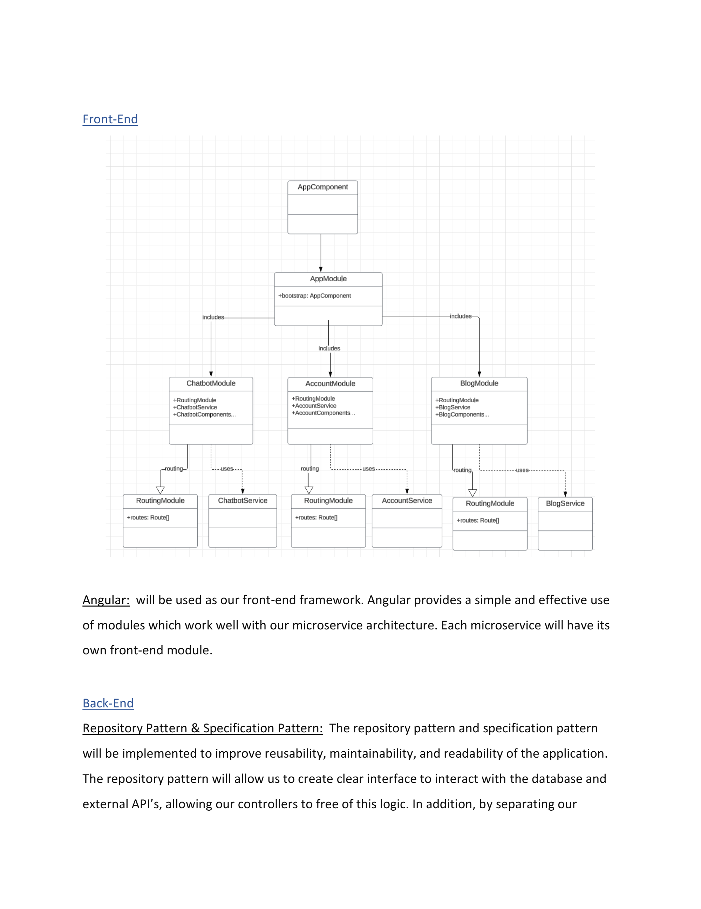
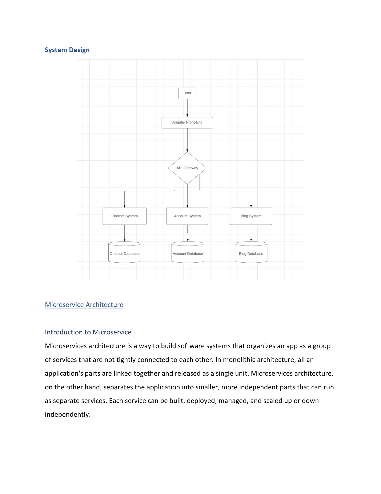

# EasySearch

## AI-Powered Customized Travel Application

EasySearch is a **microservices-based travel application** built as a Master's capstone project. It leverages AI to provide personalized travel recommendations and seamless booking experiences through a scalable, modular architecture.

---

## Architecture Overview

EasySearch follows a **microservices architecture**, separating concerns into independent, loosely-coupled services that communicate through an API Gateway. This design allows for independent development, deployment, and scaling (both vertical and horizontal) of each service.

### System Design Diagram

The diagram above illustrates the overall system architecture with the Angular front-end communicating through an API Gateway to three core microservices.

---

### System Components

- **Angular Front-End**: Modern, responsive web interface
- **API Gateway**: Central entry point for all client requests with JWT-based authentication
- **Chatbot System**: AI-powered travel assistant
- **Account System**: User management and authentication
- **Blog System**: Personalized travel content and recommendations based on user profile

Each microservice maintains its **own database**, ensuring data independence and service autonomy.

---

## Microservices Architecture

## Authentication Flow

1. **Client calls Auth Microservice**
   - Sends credentials (username/password)
   - Auth Microservice returns a JWT

2. **Client calls another API through API Gateway**
   - Sends JWT in the `Authorization: Bearer` header

3. **API Gateway validates the JWT**
   - Checks signature, expiration, and claims
   - Rejects the request if the JWT is invalid

4. **If JWT is valid**
   - Gateway forwards the request to the downstream service

5. **Downstream service processes the request**
   - Returns the response to the API Gateway
   - API Gateway forwards the response back to the client

 Token Validation Parameters

- **Issuer**: easysearch-microservice-accountapi
- **Audience**: easysearch-frontend-web
- **Algorithm**: HMAC-SHA256
- **Expiration**: 10 days from token generation

### 1. API Gateway

Central entry point that handles routing and JWT authentication validation.

**Key Features:**
- Routes requests to appropriate downstream services
- Validates JWT tokens before forwarding requests
- Supports environment-specific configuration (Development/Production)
- Configured with **Ocelot** for dynamic routing

**Technology:**
- Ocelot API Gateway
- JWT Bearer Authentication
- Duende.IdentityModel

---

### 2. Account MicroService

Handles user authentication, authorization, and profile management.

**Key Features:**
- User registration and login
- JWT token generation
- Role-based access control
- ASP.NET Core Identity integration

**Database:** `EasySearchAccountApi` (SQL Server LocalDB)

**Technology:**
- ASP.NET Core Identity
- Entity Framework Core
- JWT token generation with symmetric key signing
- Repository pattern for data access

---

### 3. Chatbot MicroService

AI-powered conversational interface for travel assistance.

**Key Features:**
- Integration with **OpenAI GPT-3.5 Turbo**
- Location-aware responses using geolocation data
- Custom responses based on prior prompts
- Optimized for travelers with visual impairments
- Customizable prompt engineering for accessibility

**Technology:**
- OpenAI API 
- Custom prompt engineering for accessibility
- Geolocation integration (latitude/longitude support)

---

### 4. Travel Blog MicroService

Manages travel content, articles, and user-generated recommendations based on user profiles.

**Planned Features:**
- Blog post management
- Smart user profiles: Detailed and intuitive forms that capture rich user information to power AI-driven, personalized content and lifestyle suggestions- Personalize Suggestions based on the user profile
- Travel recommendations
- User-generated content
- Content categorization

---
